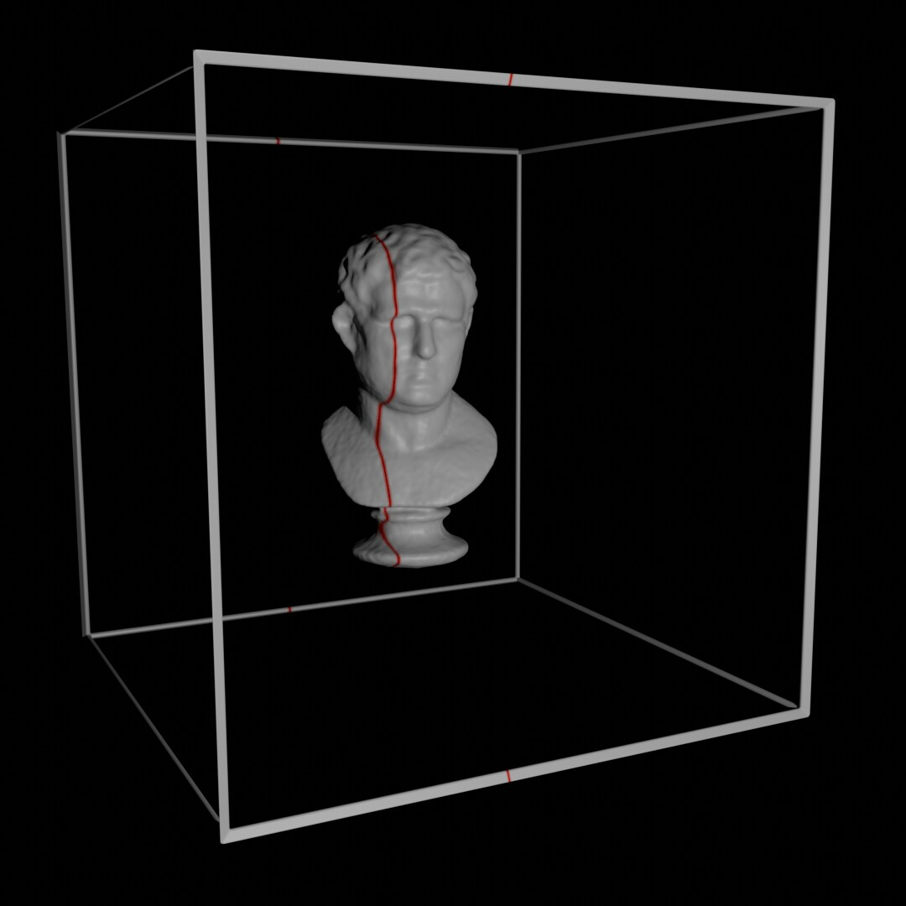
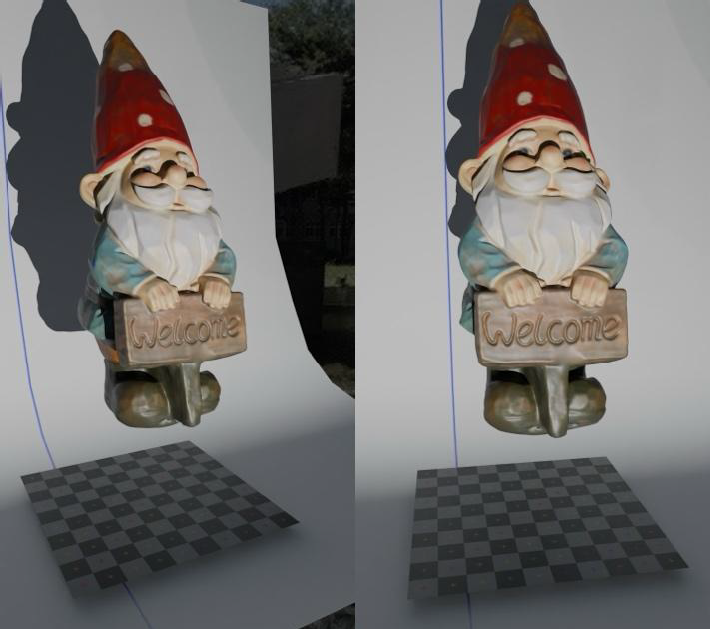
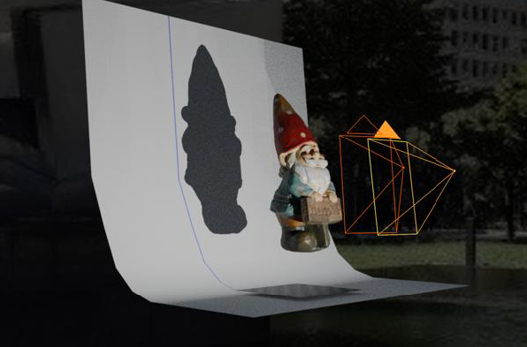

# 電腦視覺與應用期中專案說明
The midterm project is to simulate the scenario of 3D scanning device based on a known structure. In the virtual environment, there is one 3D object in a cubic frame which is 200 mm in width. We assume there is one parallel light (such as the sun) whose emitting direction is parallel to the side plane of this cube. The given images were rendering by insert one rod in front of the light. Therefore, the cast shadows will be the intersection of objects and a plane, which looks like the following figure:

# Midterm Project Source

- [ ]  Code Scripts

  - Main： [`MidtermProject.ipynb`](https://github.com/WuRobber/CVMaterial/blob/main/CV-A/MidtermProject/MidtermProject.ipynb)

- [ ]  Implementation Description

  - Report： [`R12522636_MidtermReport.pdf`](https://github.com/WuRobber/CVMaterial/blob/main/CV-A/MidtermProject/R12522636_MidtermReport.pdf)

- [ ]  Final Output

    - Coordinate File： [`R12522636.xyz`](https://github.com/WuRobber/CVMaterial/blob/main/CV-A/MidtermProject/R12522636.xyz)

- [ ]  For more implementation detail, please refer to [MidtermProject](https://github.com/WuRobber/CVMaterial/blob/main/CV-A/MidtermProject) folder. 

---
--- 
--- 

# 電腦視覺與應用期末專案說明
Write a program for reconstructing 3D points from stereoscopic images. The intrinsic and extrinsic parameters of both images are given in CameraParameter.txt. In this project, you need to write a program for importing side-by-side image sequences, and analyzing images to create a color 3D .xyz file. In addition, please reject all outliers by verifying their re-projection error. Where Fundamental matrix, and both intrinsic and extrinsic parameters were given. In each frame, you need to split it into left and right images. Try to pick out the brightest pixel (recognize it according to the blue channel) for each row in Left and find out its corresponding point in Right, as well as inverse direction, by following the constrain of epipolar geometry. Finally calculate 3D by “direct triangulation” as mentioned in lecture. Store your data into X Y Z RGB in each line of a text file with .xyz extension (can be recognized by Meshlab, as the following figure). 

---

# Midterm Project Source

- [ ]  Code Scripts

  - Main： [`main.ipynb`](https://github.com/WuRobber/CVMaterial/blob/main/CV-A/FinalProject/main.ipynb)

- [ ]  Implementation Description

  - Report： [`R12522636_FinalReport.pdf`](https://github.com/WuRobber/CVMaterial/blob/main/CV-A/FinalProject/R12522636_FinalReport.pdf)

- [ ]  Final Output

    - Coordinate File： [`R12522636.txt`](https://github.com/WuRobber/CVMaterial/blob/main/CV-A/FinalProject/R12522636.txt)

- [ ]  For more implementation detail, please refer to [FinalProject](https://github.com/WuRobber/CVMaterial/blob/main/CV-A/FinalProject) folder. 
---

