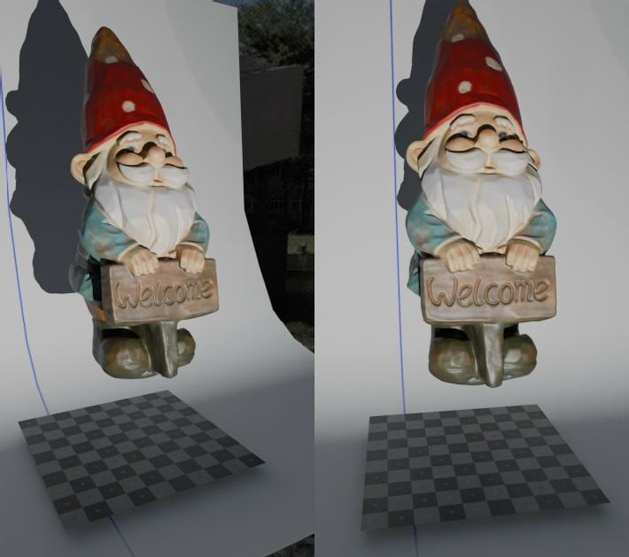
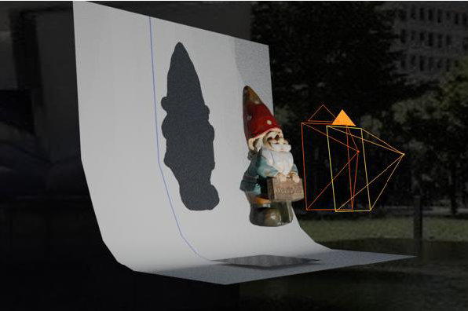

# 📌 電腦視覺與應用專案說明
## 📝 期末專案說明  
本專案的目標是透過立體視覺（stereoscopic images）重建 3D 點雲。影像的內部與外部參數已提供於 `CameraParameter.txt`，需要撰寫程式導入並分析左右影像序列，最終輸出 `.xyz` 格式的彩色 3D 座標文件。  

### 🎯 核心步驟  
1. **影像分割**：將每幀影像拆分為左、右兩張影像。  
2. **特徵點匹配**：在左影像每行選擇最亮像素（根據藍色通道辨識），尋找右影像中的對應點，並依據極線幾何約束驗證其正確性。  
3. **3D 點雲計算**：使用「直接三角測量（Direct Triangulation）」計算 3D 座標。  
4. **誤差排除**：透過重投影誤差（Re-projection Error）過濾異常點。  
5. **結果存儲**：將 `X Y Z RGB` 格式的數據存入 `.xyz` 文件，可透過 MeshLab 可視化點雲。  

#### 🔹 立體影像與點雲可視化  

  

### 📂 期末專案資源  
#### 🔹 程式碼  
- **主要程式碼：**  
  - [`main.ipynb`](https://github.com/WuRobber/CVMaterial/blob/main/CV/FinalProject/main.ipynb)  

#### 🔹 專案報告  
- [`R12522636_FinalReport.pdf`](https://github.com/WuRobber/CVMaterial/blob/main/CV/FinalProject/R12522636_FinalReport.pdf)  

#### 🔹 最終輸出  
- **座標文件：**  
  - [`R12522636.txt`](https://github.com/WuRobber/CVMaterial/blob/main/CV/FinalProject/R12522636.txt)  

