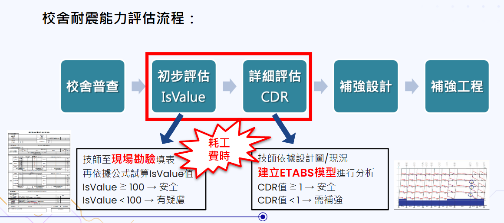

# 機器學習與深度學習導論期中競賽說明
校舍耐震能力評估：
參賽者將基於實際數據，設計或優化耐震能力評估模型，預測校舍在不同條件下的耐震指標，並確保模型的準確度和穩定性。評分標準將著重於模型的準確性、處理現場數據的能力及預測結果的可靠性。

# Midterm Competition Source

- [ ]  Code Scripts

  - Main： [`Midterm_main.ipynb`](https://github.com/WuRobber/CVMaterial/blob/main/ML/MidtermCompetition/Midterm_main.ipynb)

- [ ]  Implementation Description

  - Report： [`midterm_report.pdf`](https://github.com/WuRobber/CVMaterial/blob/main/ML/MidtermCompetition/midterm_report.pdf)

--- 
--- 

# 機器學習與深度學習導論期末競賽說明
本競賽的核心是建立一個高效的多分類模型，使其能在大量服飾圖片中正確分類，並具備良好的泛化能力。模型的評分標準將基於分類的準確度和穩定性，參賽者需要優化模型以獲得最佳效果。

---

# Final Competition Source

- [ ]  Code Scripts

  - Main： [`Main.ipynb`](https://github.com/WuRobber/CVMaterial/blob/main/ML/FinalCompetition/Main.ipynb)

- [ ]  Implementation Description

  - Report： [`final_report.pdf`](https://github.com/WuRobber/CVMaterial/blob/main/ML/FinalCompetition/final_report.pdf)
---

