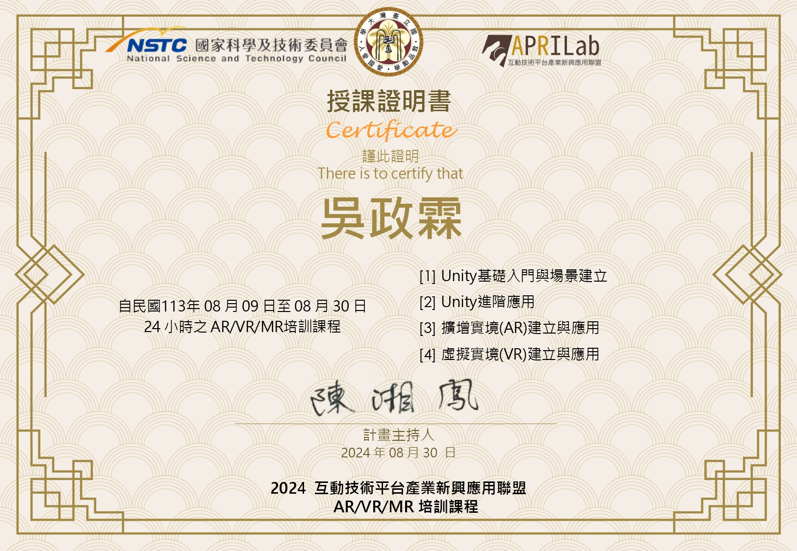

# 🎮 互動技術平台產業新興應用聯盟專案  

本專案介紹 **虛擬實境 (VR) 技術** 的概念、發展及應用，並帶領學員進行**實際操作**。  

### 🔹 課程內容概述  
✅ **VR 基礎**：從 VR 定義與應用切入，介紹頭戴顯示器 (HMD) 的發展歷史及各類追蹤技術。  
✅ **Meta Quest 系列介紹**：探討控制器比較、Guardian 系統及手勢操作。  
✅ **MRTK 與 OpenXR 應用**：學習如何使用這些工具打造互動體驗，並結合 Unity 進行實作。  
✅ **VR 互動 UI 設計**：包括影片播放器、環境搭建、物件操作等功能。  
✅ **Meta Quest Link 進階應用**：提升 VR 整合能力。  

### 🎯 期末專案：「在虛擬校園中進行專題發表」  
學員將應用所學知識，在 VR 環境中進行專案展示，提升 VR 開發實務能力。  

  

---

## 🎥 範例影片

---

## 📦 Unity 專案下載  
📥 **[Google Drive 下載](https://drive.google.com/file/d/1JDyo_FikKu33wSnqZrBXIYDo1v0kwmN3/view?usp=sharing)**  

---

## 📚 課程教材 (僅供閱讀)  
📄 **[WorkShop_Unity04_VRAppliacations](https://docs.google.com/presentation/d/1XT6bzr8kU1FbFSrkfu-mAvk5ctWBseH_/edit?usp=sharing&ouid=103139863011647393257&rtpof=true&sd=true)**  
